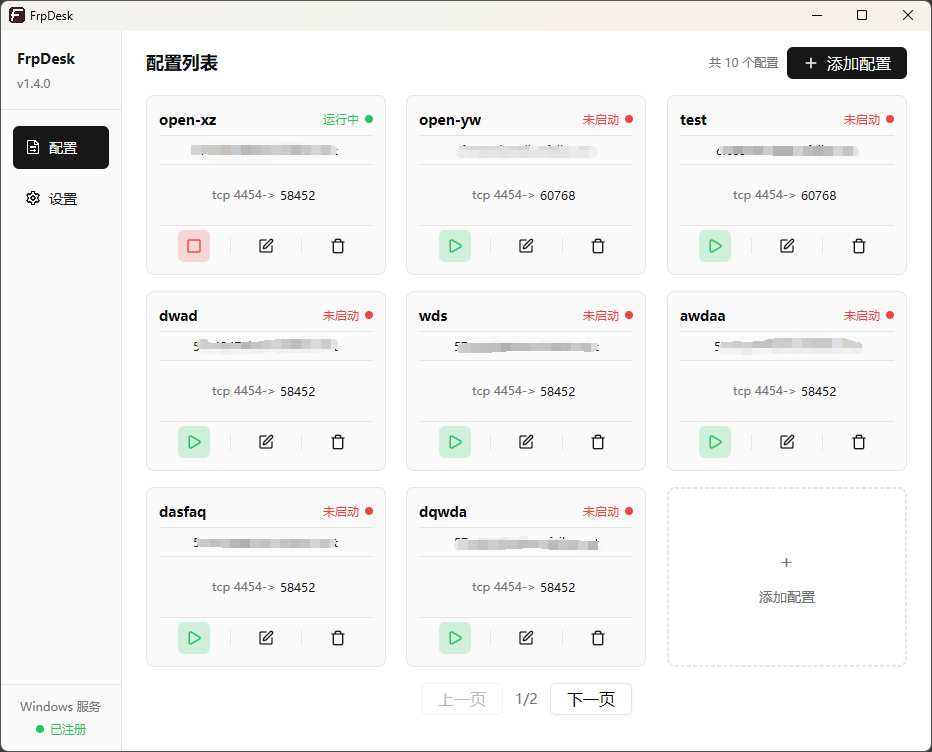
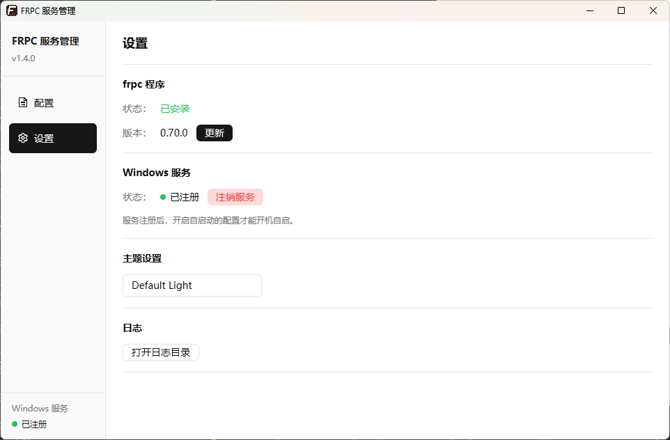

# FRPC 服务管理 (frpc-service)

一个使用 Rust 开发的 Windows Frpc管理工具，基于 [GPUI](https://github.com/zed-industries/zed) 构建现代化图形界面，用于管理多个 [frpc](https://github.com/fatedier/frp) 实例。

## 功能特性

- **多配置管理**：添加、编辑、删除多个 frpc 配置，每个配置独立运行
- **进程生命周期管理**：启动、停止、重启单个 frpc 实例，实时显示运行状态
- **开机自启**：为每个配置单独设置开机自启动，配合 Windows 服务实现无人值守
- **自动下载 frpc**：首次使用时自动从 GitHub 下载最新版本的 frpc，支持多个国内代理自动切换
- **版本更新检测**：检查 frpc 是否有新版本，一键更新
- **Windows 服务注册**：将程序注册为 Windows 服务，实现开机自启已配置的 frpc 实例
- **主题切换**：内置多套主题（亮色 / 暗色 / 海洋蓝 / 暖日落），支持一键切换并持久化
- **日志管理**：按天自动分割日志，自动清理超过 30 天的旧日志，支持运行中删除日志文件后自动重建
- **TOML 代码高亮**：配置编辑器支持 TOML 语法高亮显示
- **健康检查**：后台周期性监控 frpc 进程状态，异常退出自动更新界面
- **单实例运行**：程序只允许运行一个窗口实例

## 界面预览

**配置列表**



**设置页面**



## 使用说明

### 首次使用

1. 从 [Releases 页面](https://github.com/Colzry/frpc-service/releases) 下载 `frpc_service.exe`
2. 放入任意目录，双击运行
3. 进入 **设置** 页面，点击 **下载** 按钮自动获取 frpc 程序
4. 返回 **配置** 页面，点击 **添加配置** 填写 frpc TOML 配置
5. 点击 **启动** 按钮运行 frpc 实例

### 配置管理

- **添加配置**：点击配置列表中的虚线卡片，填写配置名称和 TOML 内容
- **编辑配置**：点击配置卡片上的 **编辑** 按钮
- **删除配置**：点击配置卡片上的 **删除** 按钮（会自动停止运行中的实例）
- **自启动**：在添加/编辑配置时设置开机自启动开关
- **分页**：每页最多显示 8 个配置，超过后自动分页

### 设置页面

| 功能 | 说明 |
|------|------|
| frpc 程序 | 查看安装状态和版本，下载或更新 frpc |
| Windows 服务 | 注册/注销 Windows 服务，实现开机自启 |
| 主题设置 | 下拉列表切换主题，支持 5 套内置主题 |
| 日志 | 打开日志目录查看运行日志 |

### Windows 服务

注册 Windows 服务后，每次开机将自动启动所有设置了 **自启动** 的 frpc 配置，未设置自启动的配置不会自动启动。服务启动完成后会自动退出，frpc 进程独立运行。

> **注意**：注册/注销服务需要管理员权限。

## 项目结构

```
src/
├── main.rs                 # 程序入口，单实例检查，分发服务模式/交互模式
├── app.rs                  # 主应用视图 AppView，事件处理，run_app 入口
├── sidebar.rs              # 侧边栏导航菜单渲染
├── pages/
│   ├── mod.rs              # 页面模块声明
│   ├── config_list.rs      # 配置列表页面（卡片网格 + 分页）
│   ├── config_editor.rs    # 配置编辑器页面（名称 + TOML 编辑 + 自启动）
│   └── settings.rs         # 设置页面（frpc 版本、服务、主题、日志）
├── config.rs               # 配置管理（conf/ 目录下的元数据和 TOML 文件）
├── frpc_mg.rs              # frpc 进程管理（启动、停止、状态监控）
├── service.rs              # Windows 服务管理（注册、注销、服务调度器）
├── download.rs             # frpc 下载模块（GitHub 代理、zip 解压、版本检查）
├── logger.rs               # 日志模块（按天轮转、自动清理、文件删除检测重建）
├── message.rs              # 消息提示组件（info/success/warning/error）
├── theme.rs                # 主题管理（加载、切换、偏好持久化）
└── icons.rs                # 自定义 SVG 图标定义和资源加载
```

## 主题系统

内置 5 套主题，通过设置页面的下拉列表切换：

| 主题名称 | 模式 | 说明 |
|----------|------|------|
| Default Light | 亮色 | 默认亮色主题 |
| Default Dark | 暗色 | 默认暗色主题 |
| Custom Dark | 暗色 | 深色侧边栏变体 |
| Ocean Blue | 暗色 | 蓝色调暗色主题 |
| Warm Sunset | 暗色 | 暖橙色调暗色主题 |

主题偏好保存在 `conf/theme.json` 中，重启后自动恢复。

## 编译

需要 Rust 环境，项目使用 GitHub Actions 构建。

```bash
# 开发构建
cargo build

# 发布构建
cargo build --release
```

输出文件：`target/release/frpc_service.exe`

### 依赖

- [gpui](https://github.com/zed-industries/zed) — Zed 编辑器的 GPU 加速 UI 框架
- [gpui-component](https://github.com/longbridge/gpui-component) — gpui 组件库（按钮、输入框、下拉列表、Spinner 等）
- [windows-service](https://crates.io/crates/windows-service) — Windows 服务 API 绑定
- [reqwest](https://crates.io/crates/reqwest) — HTTP 客户端（frpc 下载）
- [zip](https://crates.io/crates/zip) — ZIP 解压
- [log4rs](https://crates.io/crates/log4rs) — 日志框架

## 许可证

 GPL-3.0 License
